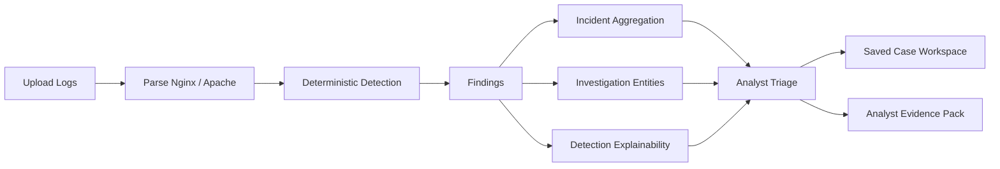

# LogForenSight

> 🛡️ Local-first security log triage for explainable, exportable, privacy-safe evidence.

**本地优先、零外部依赖、可解释、可导出的 Web 日志安全分析与处置工作台。**

[](https://github.com/Calvin1989/LogForenSight/actions/workflows/ci.yml)
[](CHANGELOG.md)
[](LICENSE)


---

## ✨ 30 秒看懂 LogForenSight

LogForenSight 不是 SIEM，也不是“把日志交给 AI 猜”的聊天式工具。

它是一条本地运行的安全分析链路：解析 Web 访问日志、执行确定性检测、聚合 incidents、提取 IOC、解释每条 detection，并导出可交接的 Analyst Evidence Pack。

* 🧪 **确定性检测**：相同输入得到相同输出，便于复核、测试和演示。
* 🔍 **调查实体抽取**：统一提取 IP、URL、账号、路径、HTTP 方法和状态码。
* 🧭 **分析师处置流**：支持状态、优先级、备注、状态汇总和 `Needs review / 待复核` 提示。
* 📦 **证据包导出**：生成包含 metadata、privacy note、validation summary 的 Markdown Evidence Pack。
* 🔐 **本地优先**：无数据库、零外部 API、无 LLM 依赖，敏感日志默认不离开本地。

---

## 🚀 核心亮点

| 能力                              | 解决的问题                                                         |
| ------------------------------- | ------------------------------------------------------------- |
| 🧾 Nginx / Apache 日志解析          | 将原始 access logs 转成结构化记录，并返回解析质量反馈                             |
| 🧠 Deterministic Detection      | 避免黑盒输出，支持复核、测试和稳定演示                                           |
| 🔗 Incident Aggregation         | 把离散 findings 聚合成更适合处置的 incidents                              |
| 🧬 IOC / Investigation Entities | 快速定位 IP、账号、URL、路径、HTTP 方法、状态码等调查对象                            |
| 🔎 Detection Explainability     | 展示规则依据、命中字段、命中指标和证据片段                                         |
| ✅ Analyst Triage Workflow       | 跟踪 Open / Investigating / Mitigated / False Positive，并提示待复核对象 |
| 💾 Saved Case Workspace         | 在本地保存、搜索、过滤、导入导出分析案例                                          |
| 📦 Evidence Pack Export         | 导出适合交接、复盘、工单流转的 Markdown 证据包                                  |

---

## ⚡ 快速开始

```powershell
docker compose up --build
```

访问：

```text
http://localhost:5173
```

本地开发：

```powershell
cd backend
pip install -r requirements.txt
uvicorn app.main:app --reload
```

```powershell
cd frontend
npm install
npm run dev
```

如遇 Windows 端口占用问题，请参考 `docs/release_notes.md`。项目默认端口和 `npm run dev` 行为保持不变。

推荐使用 `samples/` 目录中的 demo 日志快速体验完整分析链路。

---

## 🎯 适合谁？

* 蓝队 / SOC / DFIR 学习与演示
* 想展示安全工程能力的 portfolio 项目
* 需要本地处理敏感日志的分析场景
* 想理解 detection engineering / triage workflow 的开发者
* 需要可复核、可导出、可解释日志分析链路的安全分析师

---

## 🧭 工作流



---

## 🤖 为什么核心检测不依赖 LLM？

安全日志分析不是越“像 AI”越好，而是越能复核、越能解释、越能稳定落地越好。

* **可复现**：相同日志和规则应得到相同 findings、incidents 和摘要。
* **隐私安全**：访问日志可能包含 IP、账号、路径、token 或业务痕迹，不应默认上传第三方。
* **可审计**：规则命中、严重程度、证据片段都能解释，比黑盒输出更适合安全场景。
* **工程稳定**：避免提示词漂移、模型版本变化和不可控生成结果。
* **边界清晰**：LLM 可以作为外围辅助，但不作为当前核心检测路径。

---

## 🧩 技术栈

| 层级         | 技术                                                           |
| ---------- | ------------------------------------------------------------ |
| Frontend   | Vue 3, Vite, lightweight bilingual UI                        |
| Backend    | Python, FastAPI, Pydantic                                    |
| Detection  | Local deterministic rules                                    |
| Validation | Pytest, Vitest, Docker Compose                               |
| Runtime    | Local-first, no database, no external API, no LLM dependency |

---

## 🧪 当前验证状态

当前稳定版本：`v2.9.1-local`

已验证：

* Backend: `python -m pytest`
* Frontend: `npm run test`
* Frontend: `npm run build`
* Docker: `docker compose config`
* Git: `git diff --check`
* Git: `git show --check --stat HEAD`

---

## 📚 文档导航

| 文档                           | 内容                       |
| ---------------------------- | ------------------------ |
| `docs/demo.md`               | 推荐演示路径                   |
| `docs/portfolio.md`          | 项目展示与面试讲解                |
| `docs/release_notes.md`      | 版本说明                     |
| `docs/architecture.md`       | 架构说明                     |
| `docs/api_contract.md`       | API 契约                   |
| `docs/github_listing.md`     | GitHub About / Topics 建议 |
| `docs/screenshots/README.md` | 截图规划说明                   |

---

## 🏷️ GitHub Topics 建议

`security-tools` · `log-analysis` · `incident-response` · `dfir` · `threat-hunting` · `ioc-extraction` · `detection-engineering` · `fastapi` · `vue` · `local-first`

---

## 🚧 项目边界

LogForenSight 当前聚焦 **Web access log analysis**，不扩展为通用 SIEM、云原生日志平台或实时告警系统。

当前核心价值是：

* deterministic
* local-first
* explainable
* exportable
* analyst-friendly

后续更适合继续深化规则能力、证据导出、案例管理和调查视图，而不是牺牲可复现性去换取不可控的“智能化包装”。

---

## 📄 License

MIT
